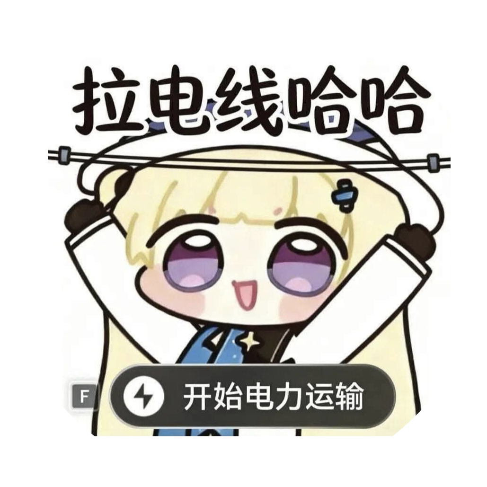

<h1 align="center">
    <br>
    skport-auto-signin
</h1>

<p align="center">
    
    
    <br><a href="/README_zh-tw.md">繁體中文</a>　<a href="/README.md">English</a>　<b>Русский</b>
</p>

Стабильный, безопасный и бесплатный скрипт для автоматического получения ежедневных наград SKPORT.
Поддерживает **Arknights: Endfield**. Поддерживает несколько учётных записей.

## Возможности

- **Стабильность** — Минимальная настройка. Рекомендуемый скрипт включает логику повторных попыток, автоматическое обновление токена и контроль времени выполнения.
- **Безопасность** — Развёртывается в вашем собственном проекте Google Apps Script. Учётные данные не покидают ваш аккаунт Google.
- **Бесплатность** — Google Apps Script является бесплатным сервисом Google.
- **Простота** — Работает на сервере без браузера. Автоматически отправляет результаты в Discord и/или Telegram.

## Быстрый старт

### 1. Создайте проект Google Apps Script

Перейдите на [Google Apps Script](https://script.google.com/home/start) и создайте новый проект (имя — любое).

### 2. Вставьте скрипт

Откройте редактор (Code.gs) и замените его содержимое кодом из
[`src/main-disc-tele.gs`](https://github.com/NatsumeAoii/skport-auto-signin/blob/main/src/main-disc-tele.gs).

> Это рекомендуемый скрипт. Он поддерживает уведомления Discord и Telegram,
> автоматическое обновление токена, повторные попытки с экспоненциальной задержкой и ограничение времени выполнения.

### 3. Настройте конфигурацию

Отредактируйте массив `profiles` и настройки уведомлений в начале скрипта.
Подробности см. в разделе [Конфигурация](#конфигурация).

### 4. Запустите вручную один раз

Выберите `main` из выпадающего списка функций и нажмите **Run**.
При запросе предоставьте необходимые разрешения. Убедитесь, что в журнале выполнения отображается `Execution started > completed`.


### 5. Настройте ежедневный триггер

Нажмите **Triggers** (значок часов) на левой панели, затем **Add Trigger**:


| Параметр | Значение |
|----------|----------|
| Функция для запуска | `main` |
| Источник события | По времени |
| Тип триггера | Ежедневно |
| Время выполнения | Выберите непиковое время (рекомендуется 09:00–15:00) |


> **Альтернатива:** Запустите функцию `setupDailyTrigger()` один раз из редактора вместо ручной настройки триггера. Она создаёт ежедневный триггер для `main` в 09:00.

## Конфигурация

```javascript
const profiles = [
  {
    SK_OAUTH_CRED_KEY: "",   // Обязательно — ваш OAuth-ключ SKPORT (из cookie)
    SK_TOKEN_CACHE_KEY: "",  // Необязательно — оставьте пустым; скрипт получает его автоматически
    id: "",                  // Обязательно — ваш игровой ID в Arknights: Endfield (число)
    server: "2",             // Обязательно — Азия = "2", Америка/Европа = "3"
    language: "en",          // Необязательно — en | ja | zh_Hant | zh_Hans | ko | ru_RU
    accountName: ""          // Обязательно — отображаемое имя в уведомлениях
  }
];

// Настройки уведомлений Discord
const discord_notify = true;
const discordWebhook = "";    // URL вебхука вашего канала Discord

// Настройки уведомлений Telegram
const telegram_notify = false;
const myTelegramID = "";      // Ваш Telegram ID
const telegramBotToken = "";  // Токен вашего Telegram-бота

// Настройки отображения (необязательно)
const botDisplayName = "Arknights Endfield Auto Sign-In";
const botAvatarUrl = "https://i.imgur.com/TguAOiA.png";
const embedTitle = "Endfield Daily Check-In";
```

> Должен быть полностью настроен хотя бы один канал уведомлений (Discord или Telegram). Скрипт завершится досрочно, если ни один из них не готов.

### Получение SK_OAUTH_CRED_KEY

1. Откройте [страницу ежедневных наград SKPORT](https://game.skport.com/endfield/sign-in) и войдите в аккаунт.
2. Откройте консоль разработчика браузера (F12 → вкладка Console).
3. Вставьте и запустите содержимое [`src/getToken.js`](https://github.com/NatsumeAoii/skport-auto-signin/blob/main/src/getToken.js).
4. Ключ будет скопирован в буфер обмена (или показан в диалоговом окне, если доступ к буферу обмена запрещён).
5. Вставьте значение в поле `SK_OAUTH_CRED_KEY` в вашем скрипте.

> **Безопасность:** Обращайтесь с `SK_OAUTH_CRED_KEY` как с паролем. Не добавляйте его в публичный репозиторий.
> Для дополнительной безопасности вы можете хранить учётные данные в **Script Properties** GAS и ссылаться на них
> с префиксом `prop:` (например, `SK_OAUTH_CRED_KEY: "prop:MY_CRED"`). Скрипт автоматически разрешает их
> через `PropertiesService`.

<details>
<summary><b>Справочник полей профиля</b></summary>

| Поле | Обязательно | Описание |
|------|-------------|----------|
| `SK_OAUTH_CRED_KEY` | Да | OAuth-ключ из cookie SKPORT. Получается с помощью `getToken.js`. |
| `SK_TOKEN_CACHE_KEY` | Нет | Оставьте пустым. Скрипт автоматически получает и обновляет этот токен, используя ваш OAuth-ключ. |
| `id` | Да | Ваш игровой ID в Arknights: Endfield (число). |
| `server` | Да | `"2"` — Азия, `"3"` — Америка/Европа. |
| `language` | Нет | Язык отображения: `en`, `ja`, `zh_Hant`, `zh_Hans`, `ko`, `ru_RU`. По умолчанию `en`. |
| `accountName` | Да | Никнейм, отображаемый в уведомлениях. |

**Несколько аккаунтов:** Добавьте дополнительные объекты в массив `profiles`.

</details>

<details>
<summary><b>Настройка уведомлений Discord</b></summary>

1. Установите `discord_notify` в `true`.
2. **discordWebhook** — [Создайте вебхук](https://support.discord.com/hc/en-us/articles/228383668) для канала, в который будут отправляться уведомления.

</details>

<details>
<summary><b>Настройка уведомлений Telegram</b></summary>

1. Установите `telegram_notify` в `true`.
2. **myTelegramID** — Отправьте `/getid` боту [@IDBot](https://t.me/myidbot), чтобы получить ваш числовой Telegram ID.
3. **telegramBotToken** — Отправьте `/newbot` боту [@BotFather](https://t.me/botfather), чтобы создать бота и получить токен. [Подробное руководство](https://core.telegram.org/bots/features#botfather).

</details>

## Примеры

Успешный сбор наград отправляет «OK». Если награды уже получены сегодня — приходит соответствующее уведомление.


## Варианты скриптов

| Файл | Статус | Описание |
|------|--------|----------|
| [`main-disc-tele.gs`](src/main-disc-tele.gs) | **Рекомендуемый** | Единый скрипт с поддержкой Discord и Telegram, автоматическим обновлением токена, логикой повторных попыток, контролем времени выполнения и блокировкой на уровне скрипта. |
| [`main-discord.gs`](src/main-discord.gs) | Устаревший | Только Discord, без автообновления, без повторных попыток. Сохранён для справки. |
| [`main-telegram.gs`](src/main-telegram.gs) | Устаревший | Только Telegram, без автообновления, без повторных попыток. Сохранён для справки. |
| [`getToken.js`](src/getToken.js) | Утилита | Скрипт для консоли браузера для извлечения `SK_OAUTH_CRED_KEY` из cookie SKPORT. |

## Структура проекта

```
skport-auto-singin/
├── pic/                     # Скриншоты и логотип для документации
│   ├── logo.svg
│   └── 01–05.png
├── src/
│   ├── main-disc-tele.gs    # Рекомендуемый: единый скрипт GAS
│   ├── main-discord.gs      # Устаревший: только Discord
│   ├── main-telegram.gs     # Устаревший: только Telegram
│   └── getToken.js          # Утилита для извлечения учётных данных
├── README.md                # Документация на английском
├── README_zh-tw.md          # Документация на традиционном китайском
├── README_ru.md             # Документация на русском
└── LICENSE                  # MIT
```

## Устранение неполадок

| Симптом | Причина | Решение |
|---------|---------|---------|
| «User is not logged in» или «OAuth Key Expired» | Срок действия `SK_OAUTH_CRED_KEY` истёк. | Войдите заново на [странице наград](https://game.skport.com/endfield/sign-in) и повторно запустите `getToken.js` для получения нового ключа. |
| «Token expired» (код 10000), автообновление не помогает | Истёк как токен, так и OAuth-ключ. | Аналогично — повторно получите `SK_OAUTH_CRED_KEY`. |
| Уведомления не приходят | Канал уведомлений не полностью настроен. | Убедитесь, что хотя бы один канал имеет флаг `true` и все обязательные поля (URL вебхука или токен бота + chat ID) заполнены. |
| «Another instance is running» | Предыдущее выполнение ещё активно или блокировка не была снята. | Подождите несколько минут. Блокировки GAS истекают автоматически. |
| Триггер не срабатывает | Триггер настроен неправильно или превышена квота GAS. | Проверьте наличие триггера в панели Triggers. Проверьте [квоты](https://developers.google.com/apps-script/guides/services/quotas) GAS. |

## Журнал изменений

- **2026-02-23** — Масштабное обновление: объединены Discord и Telegram в `main-disc-tele.gs`, внедрено форматирование Rich Embed/HTML, добавлено автоматическое получение и обновление `SK_TOKEN_CACHE_KEY`, локализованы временные метки.
- **2026-02-14** — Исправлен баг. Спасибо Keit (@keit32) за помощь.
- **2026-01-29** — Проект запущен.

## Благодарности

- **[canaria](https://github.com/canaria3406)** — Автор и создатель оригинального скрипта Skport Auto Sign-In.

## Лицензия

[MIT](LICENSE)
